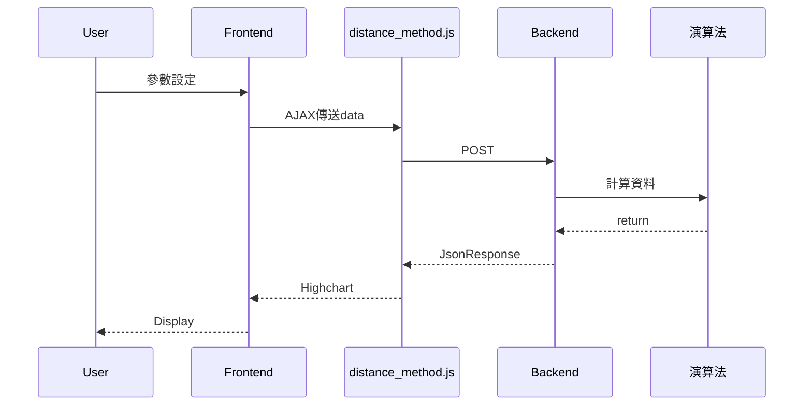
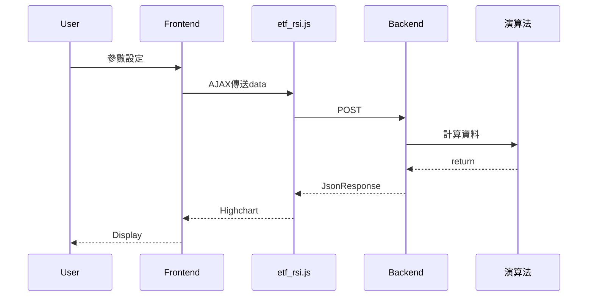
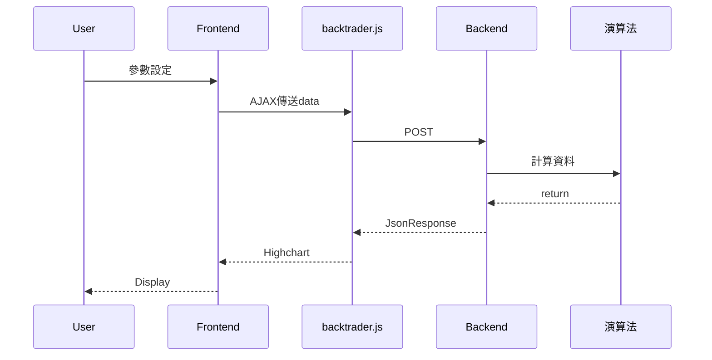
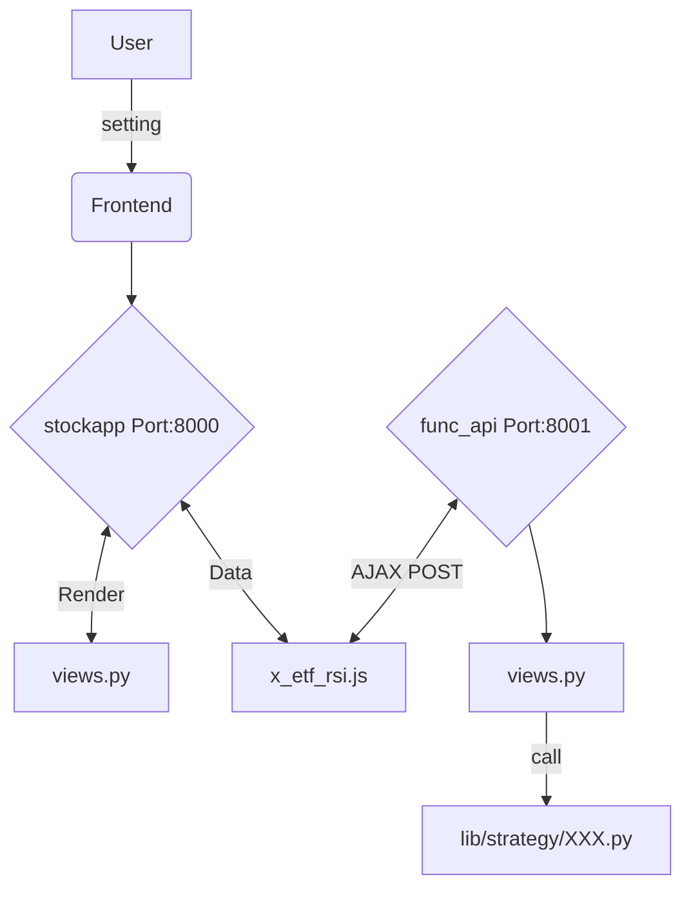
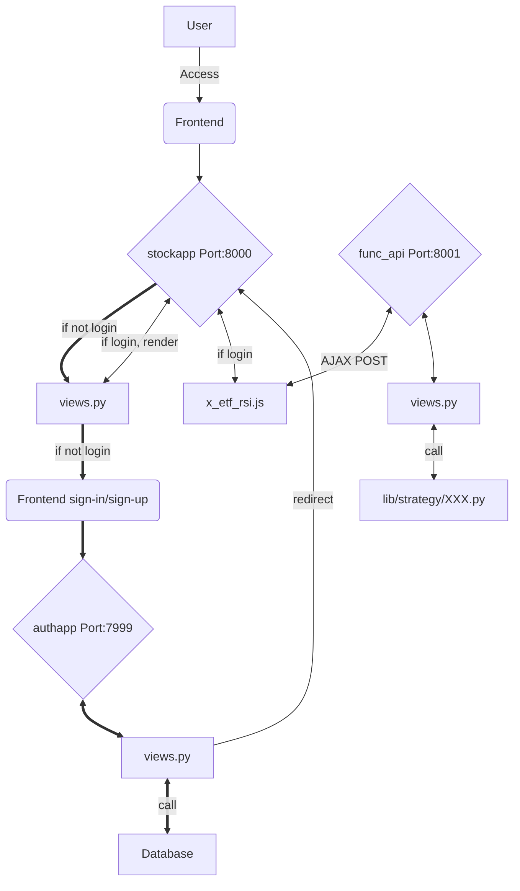
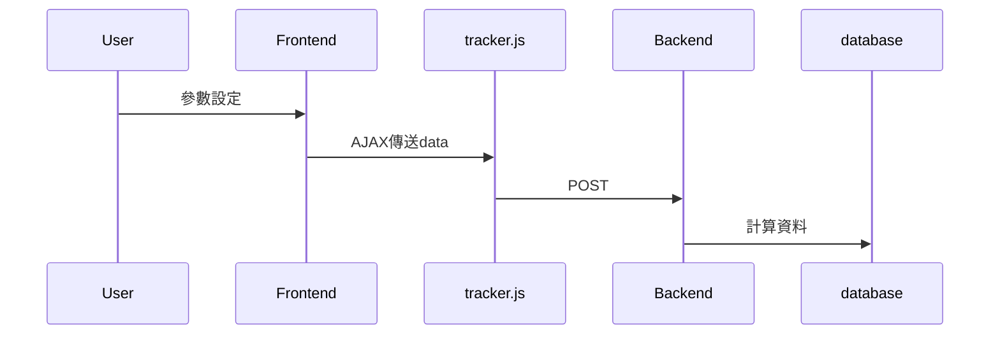
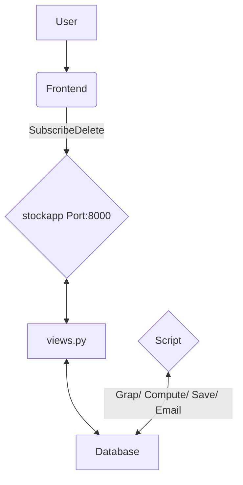
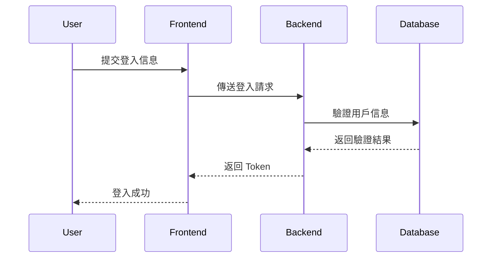

# 股票分析工具網站實作報告
謝明翰
## Homework

### HW1

#### 1.1 目標
輸入股票代號、起始日、結束日，window size和標準差大小，用yahoo finance抓取區間內的資料並用distance mathod 計算進出場資料以及獲利，highchart stock畫圖，Datatable呈現資料

#### 1.2 架構圖

#### 1.3 成果介紹


#### 1.4 實作中學習到的知識與遭遇的困難
此Django server 使用port 8000
```
$ python manage.py runserver 8000
```
學習到如何架設Django server。並撰寫以下檔案:
```
mytestsite
    |- settings.py
stockapp
    |- urls.py
    |- views.py
    |- x_distance_method.py
```
settings.py與整個Server的環境有關。
urls.py決定哪個路由，由哪個views.py的函數處理。
views.py負責與前端javascript溝通以及與使用演算法。
x_distance_method.py實現演算法的部分。
除此之外，也學習到網頁前端如何與後端溝通，POST、GET是常見的方式，AJAX負責溝通的協議，使得Web應用程式更為迅捷地回應使用者動作。
### HW2.1
#### 1.1 目標
輸入股票代號、起始日、結束日、long, short term，用yahoo finance抓取區間內的資料並用RSI指標黃金交叉策略，計算進出場資料以及獲利，highchart stock畫圖，Datatable呈現資料。


#### 1.2 架構圖


#### 1.3 成果介紹


#### 1.4 實作中學習到的知識與遭遇的困難
此Django server 使用port 8000
```
$ python manage.py runserver 8000
```
主要撰寫以下檔案:
```
mytestsite
    |-
stockapp
    |- urls.py
    |- views.py
    |- x_etf_rsi.py
```
urls.py決定哪個路由，由哪個views.py的函數處理。
views.py負責與前端javascript溝通以及與使用演算法。
x_etf_rsi.py實現演算法的部分。
主要重複HW1的操作
### HW2.2
#### 1.1 目標
輸入股票代號、起始日、結束日、選擇策略，設定初始金額以及其他參數，用yahoo finance抓取區間內的資料並用特定指標，來做回測策略，計算進出場資料以及獲利，highchart stock畫圖，Datatable呈現資料。
學習如何使用backtrader來做回測。


#### 1.2 架構圖

#### 1.3 成果介紹

#### 1.4 實作中學習到的知識與遭遇的困難
此Django server 使用port 8000
```
$ python manage.py runserver 8000
```
主要撰寫以下檔案:
```
mytestsite
    |-
stockapp
    |- urls.py
    |- views.py
    |- x_backtrader.py
```
* urls.py決定哪個路由，由哪個views.py的函數處理。
* views.py負責與前端javascript溝通以及與使用演算法。
* x_backtrader.py實現演算法的部分。
- 遇到的困難主要是，如何還傳圖片給前端，需要先在後端做編碼，再回傳給前端渲染
### HW3.1 REST API Framework

#### 1.1 目標、架構圖
mytestsite只負責渲染，資料交換都需要存取另一個django server

- stockapp (Django server)

- func_api (Django server)

主要撰寫以下檔案:
```
mytestsite/
|-- mytestsite/
|   |- settings.py // add rest_framework at app
|                  // add CORS_ALLOWED_xx & CSRF_TRUSTED_ORIGINS
|-- stockapp/
        |- urls.py
        |- views.py

func_api/
|-- func_api/
|   |- settings.py // add rest_framework at app
|   |              // add CORS_ALLOWED_xx & CSRF_TRUSTED_ORIGINS
|   |- urls.py
|-- lib/
|   |- strategy/
|       |- x_distance_method.py
|       |- x_etf_rsi.py
|-- options_func/ // this is app
        |- urls.py
        |- views.py
        |- x_backtrader.py

```
#### 1.2 實作中學習到的知識與遭遇的困難
學習如何讓兩個server溝通，並撰寫REST api framework。並且學會如何讓api server擴充功能更容易

### HW3.2 Sign in, Sign up, Log out、HW4 secured api

#### 1.1 目標



```
mytestsite/
|-- mytestsite/
|   |- settings.py // SECRET_KEY sharing
|                  
|-- stockapp/
        |- urls.py
        |- views.py

authsite/
|-- authsite/
|   |- settings.py // SECRET_KEY sharing
|
|-- authapp/       // this is app
        |- urls.py
        |- views.py
|-- template/      // frontend html for login/sign-up
        |- 

```
#### 1.2 實作中學習到的知識與遭遇的困難
如何讓程式碼寫得更精簡，方便管理，以及新增功能，例如mytestsite，只負責渲染，但是又要對每個路由檢驗是否授權，這個授權可以透過一個窗口完成，而不需要每個路由都新增一個檢驗授權的程式碼。

### HW5
#### 1.1 目標
輸入完參數以後，按下Subscribe，會將使用者名稱以及參數送到資料庫裡。每天固定的時間會去資料庫裡拿取所有使用者送出來的參數進行進出場訊號的計算，將計算結果儲存下來，回傳到前端、以及發送email通知。也可以刪除。

#### 1.2 流程圖


#### 1.3 成果介紹


#### 1.4 實作中學習到的知識與遭遇的困難
此Django server 使用port 8000
```
$ python manage.py runserver 8000
```
學習到如何架設Django server。並撰寫以下檔案:
```

stockapp
    |- urls.py
    |- views.py
static
    |- js/
        |- tracker.js
db_fetch.py   // Grap/ Compute/ Save/ Email
```
urls.py決定哪個路由，由哪個views.py的函數處理。
views.py負責與前端javascript溝通以及與使用演算法。
tracker.js 有點特別，需要去請求database的資料出來，然後按下Home鍵，動態的去把訂閱資料拿出來顯示


### HW9

### HW10

### HW11

### HW12

## Final Project
### 一、專案簡介

#### 1.1 專案背景與目的

隨著金融市場的快速變化，投資者越來越需要即時、準確的分析工具來支持決策。本專案旨在建立一個股票分析工具網站，結合多種技術分析指標和策略，為使用者提供全面的市場分析與建議。

#### 1.2 核心功能概述

- 股票定價策略（股利法、本淨比法、本益比法等）
- 技術指標分析（KD指標、MACD、布林通道等）
- 自動化追蹤與提醒
- 資料視覺化展示（K線圖、盈虧走勢圖）
- 使用者登入與個性化設置

---

### 二、系統架構設計

#### 2.1 系統架構圖


#### 2.2 功能模組劃分

- **前端（Frontend）：**

  - 使用 HTML5、CSS、JavaScript、Highcharts 等技術構建互動式界面。
  - 提供即時數據展示與使用者操作入口。

- **後端（Backend）：**

  - 使用 Django Rest Framework 搭建 API。
  - 包含數據處理邏輯、策略計算與用戶管理。

- **資料庫（Database）：**

  - PostgreSQL，存儲歷史股價、用戶資料及分析結果。

- **分析模組（Function API）：**

  - 基於 Django 構建的分析 API，負責調用金融模組進行數據分析。

- **金融模組（Financial Module）：**

  - 集成 Finlab、Talib 等模組進行技術分析與策略運算。

---

### 三、功能設計與實作

#### 3.1 使用者登入與個性化設置

##### 功能描述

- 提供註冊、登入及登出功能。
- 支持用戶設置追蹤參數、策略選擇等。

##### 實作步驟

1. **前端：**
   - 設計註冊與登入表單，使用 AJAX 與後端進行交互。
2. **後端：**
   - 使用 Django 的內建認證模組。
   - 設置 Token-based 認證機制，保障用戶數據安全。

##### 功能圖



---

#### 3.2 股票定價策略模組

##### 功能描述

- 提供股利法、高低價法、本淨比法及本益比法的計算功能。

##### 實作步驟

1. **資料收集：**
   - 使用 `twstock` 套件獲取即時股價。
   - 爬取歷史數據，計算股利、EPS 等指標。
2. **後端計算邏輯：**
   - 定義各策略的計算公式，返回便宜價、合理價及昂貴價。
3. **前端展示：**
   - 用表格與圖表顯示計算結果，便於使用者比較分析。

##### 功能圖


---

#### 3.3 技術指標分析

##### 功能描述

- 提供 KD 指標、MACD 指標、布林通道等技術分析工具。

##### 實作步驟

1. **指標計算：**
   - 使用 Talib 庫進行指標計算。
   - 支持自定義參數，如移動平均線窗口大小。
2. **圖表渲染：**
   - 前端利用 Highcharts 實現 K 線圖與技術指標的疊加顯示。
3. **即時數據：**
   - 從 Function API 獲取即時分析結果，並動態更新。

---

#### 3.4 自動化追蹤與提醒

##### 功能描述

- 允許用戶設定股票追蹤清單，並接收每日的追蹤報告。

##### 實作步驟

1. **追蹤設定：**
   - 從用戶界面設置追蹤股票及條件。
   - 將追蹤參數存入資料庫。
2. **每日執行：**
   - 使用 Crontab 定時觸發腳本，執行追蹤邏輯。
   - 調用 Function API 獲取分析結果，生成報告。
3. **郵件通知：**
   - 使用 SMTP 協議發送追蹤報告與損益表。

---

### 四、總結與學習反思

#### 4.1 成果展示

本專案成功實現股票定價分析、技術指標展示與自動化追蹤功能，為用戶提供了全方位的投資分析支持。

#### 4.2 遇到的挑戰

- 數據處理效率：需優化算法以提升分析速度。
- 用戶體驗：需改善界面交互，使功能更加直觀易用。

#### 4.3 未來改進方向

- 引入更多策略與指標，增強工具功能。
- 添加多語言支持，擴大用戶群體。
- 使用 AI 模型進行智能化投資建議。

---

**參考資料：**

1. [Django Rest Framework 官方文檔](https://www.django-rest-framework.org/)
2. [Talib 技術指標文檔](https://havocfuture.tw/blog/python-indicators-talib)
3. [twstock Python 套件](https://twstock.readthedocs.io/)

